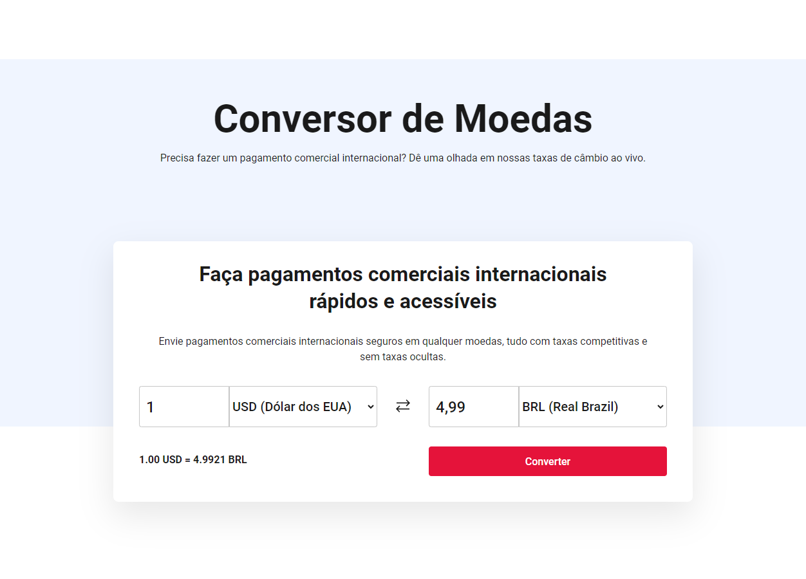
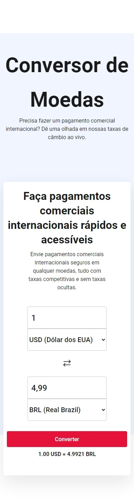

<h2 align="center"> 
	Conversor de moedas 🪙
</h2>

<p align="center">
 <a href="#-sobre-o-projeto">Sobre</a> •
 <a href="#-layout">Layout</a> • 
 <a href="#-conexão-api">Conexão Api</a> •
 <a href="#-como-executar-o-projeto">Como executar</a> • 
 <a href="#-tecnologias">Tecnologias</a> •  
 <a href="#-autor">Autor</a> • 
</p>

## 📝 Sobre o projeto

 Conversor de moedas para pagamentos internacionais. Planejando efetuar um pagamento comercial internacional? Consulte as taxas de câmbio atualizadas em tempo real.

## 🔗 Conexão Api
 Para realizar as conversões de moedas e obter informações sobre taxas de câmbio neste projeto, utilizei a [ExchangeRate-API](https://www.exchangerate-api.com/docs/overview). Essa API fornece acesso a dados precisos e atualizados sobre moedas e câmbio, facilitando a realização de pagamentos comerciais internacionais.

## 🎨 Layout

O layout foi inspirado no figma currency converter e personalizado para atender às necessidades do projeto, sendo desenvolvida utilizando a tecnologia Vue.js

<a href="https://www.figma.com/file/6U48h6GEXZoCK3JQ5lgmf3/Currency-Convertor-(Community)?type=design&mode=design&t=b60ENdgtWSO0oE8X-0">
  
</a>

<h3 align="center"> Desktop 💻 </h3>
<p align="center" style="display: flex; align-items: flex-start; justify-content: center;">
  
</p>
<h3 align="center"> Mobile 📱 </h3>
<p align="center" style="display: flex; flex-direction:column ;align-items: center; justify-content: flex-start;"> 
    
</p>

<h4 align="center"> 
	Currency Convertor | Concluído 🔎
</h4>

---

## 📌 Como executar o projeto

####  ⏳ Pré-requisitos

Antes de começar, você vai precisar ter instalado em sua máquina as seguintes ferramentas:
[Git](https://git-scm.com), [Vue.js](https://vuejs.org/guide/quick-start.html#creating-a-vue-application) e [Node.js](https://nodejs.org/en). Além disto é bom ter um editor para trabalhar com o código como [VSCode](https://code.visualstudio.com/)

#### ⚙️ Configuração da API

Antes de utilizar a API, é necessário obter uma chave de acesso (API key) seguindo as instruções fornecidas na documentação. Esta chave deve ser mantida em segurança e nunca compartilhada publicamente. A documentação completa da API ExchangeRate-API pode ser encontrada [aqui](https://www.exchangerate-api.com/docs/overview).
 
#### 🧭 Rodando a aplicação

```bash
# Clone este repositório
$ git clone git@github.com:danilalucas/currency-converter.git
# Acesse a pasta do projeto no terminal/cmd
$ cd currency-converter
# Instale os pacotes necessários
$ npm install
# Copie o arquivo .env.example para .env
$ cp .env.example .env
# Insira a url base da api e a chave no arquivo .env
VITE_API_KEY='SUA_API_KEY'
VITE_API_BASE_URL='URL_BASE'
# Execute a aplicação
$ npm run dev
# Compilar para produção
$ npm run build
```
---

## 🛠 Tecnologias

As seguintes ferramentas foram usadas na construção do projeto:

-   **[HTML](https://html.com/)**
-   **[CSS](https://www.w3.org/Style/CSS/Overview.en.html)**
-   **[JS](https://www.javascript.com/)**
-   **[Vue.js](https://vuejs.org/)**
-   **[Node.js](https://nodejs.org/en)**

---

## 👩🏻‍💻 Autor

<a href="https://github.com/danilalucas">
 
 <br />
 <sub><b>Daníla Lucas</b></sub></a> <a href="https://github.com/danilalucas" title="Profile"></a>
 <br />

[](https://www.linkedin.com/in/danila-lucas/) 
[](mailto:danilatlucas@gmail.com)

Feito com ❤️ por Daníla Lucas 👋🏻 [Entre em contato!](https://www.linkedin.com/in/danila-lucas/)

---
